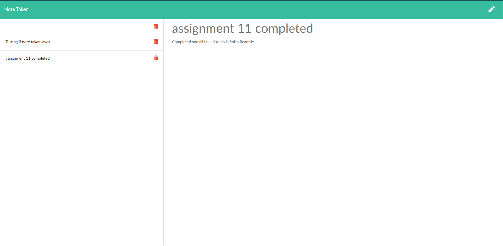

# Note_Taker

# Table of Contents

* [Process](#Process)
* [Issues](#Issues)
* [Link](#Link)
* [Screenshot](#Screenshot)

# Process

open up webpage through heroku.

Next click the get started button.

Next type a title for the notes.

Type out notes and click the save button at the top right corner.

You can do this multiple times.

To delete click the trashcan and the note chosen will be deleted.

# Issues

My issue my initial start to typing the code I tried to fit it all in one js.

But this looked messy and hard even for my self to follow clearly.

I seperated the code into 3 different js files

I kept forgetting to add extra . for my pathing and when trying to:

save, delete, or go to the notes.html nothing worked.

Had to re read every line of code and change variables from let and const and var.

I did this to make sure I was not causing errors myself.

# Link

[My link to heroku](https://notetaker-11.herokuapp.com/)

# Screenshot

